# 创建函数
实现账号密码登录

1. 在模型目录中创建一个用户分组(user)
2. 在公共分组中创建一个BaseTimeDomain,并继承BaseIdDomain
3. 在用户分组中创建一个数据表类型的用户模型(User),继承BaseTimeDomain

User信息为
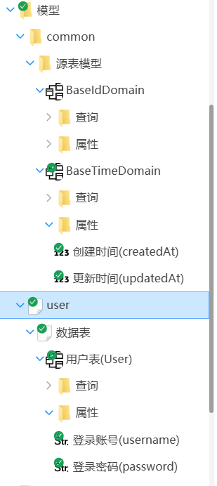
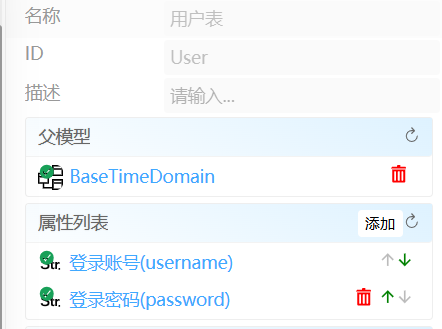

4. 创建属性字段
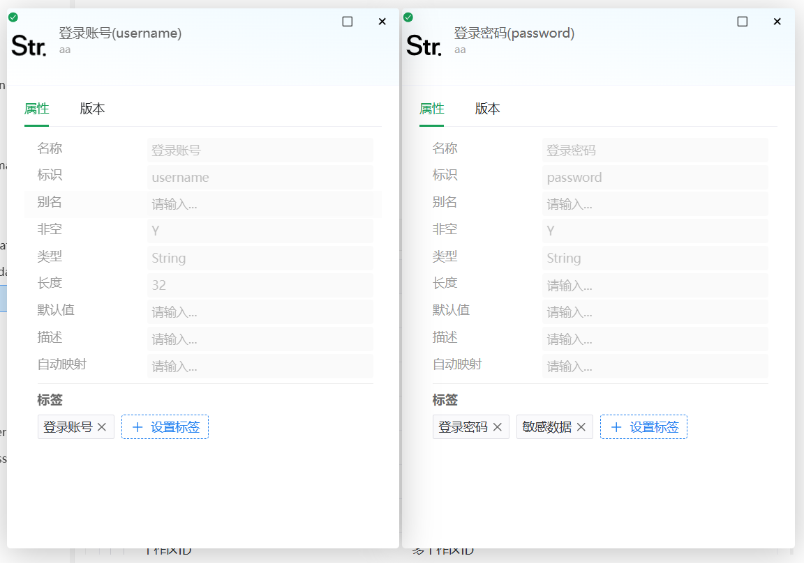

5. 创建一个输入模型(UserLoginRequest),将User模型中的登录账号和密码拖拽到属性栏中
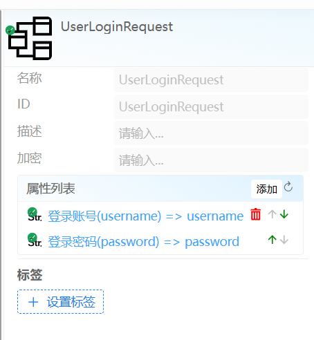

6. 创建登录返回模型(UserLoginResponse)
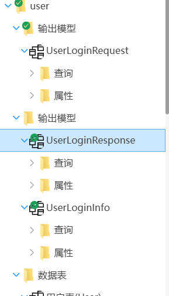

添加属性
userInfo 为引用属性，将应用模型拖入关联
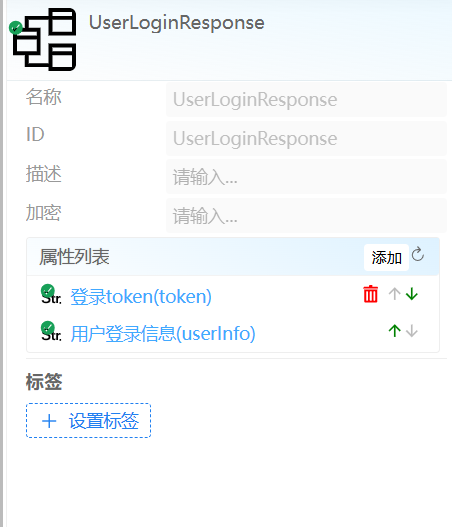
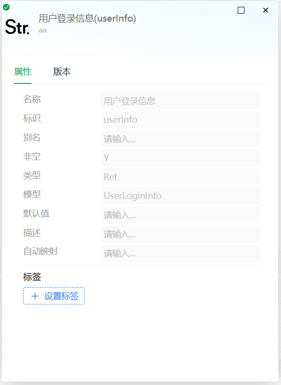

7. 创建一个用户分组函数 user,已经UserFunction模块，和一个登录函数
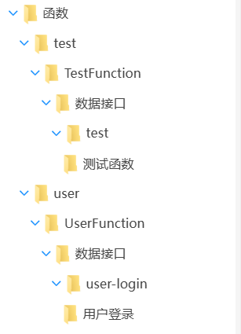

配置函数的属性
资源ID: user_login => 登录接口 POST /api/user/login
拖拽输入/输出模型到配置项
实现方式：编码实现
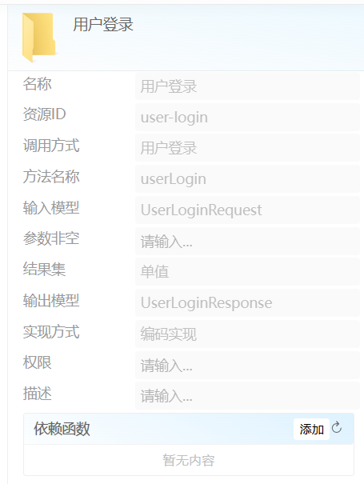

8. 编写登录函数
双击用户登录函数打开代码编辑
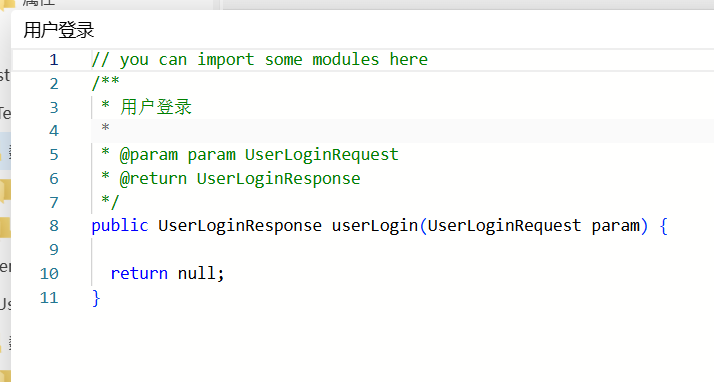

实现登录方法
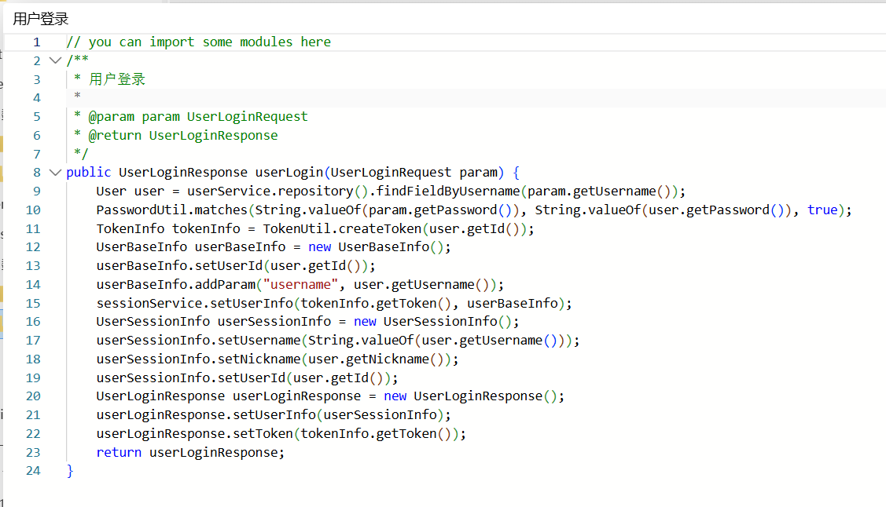

说明： 
1. XxxService, 每一个数据表都对应一个 XxxService,如 UserService
2. 操作数据表，使用 xxxService.repository().yyy()，如userService.repository().findFieldByUsername(param.getUsername())
3. xxxService，常用工具类会自动注入，无需手动引入
4. sessionService 为提供的默认缓存实现，可将登录信息调用sessionService缓存
